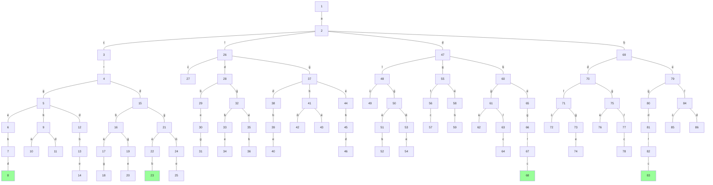
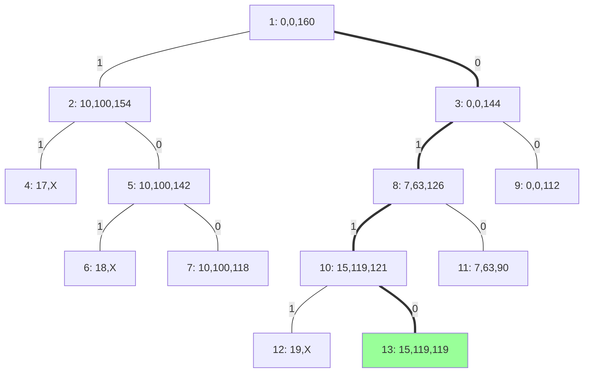
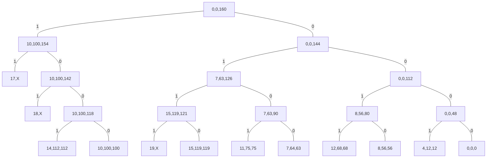
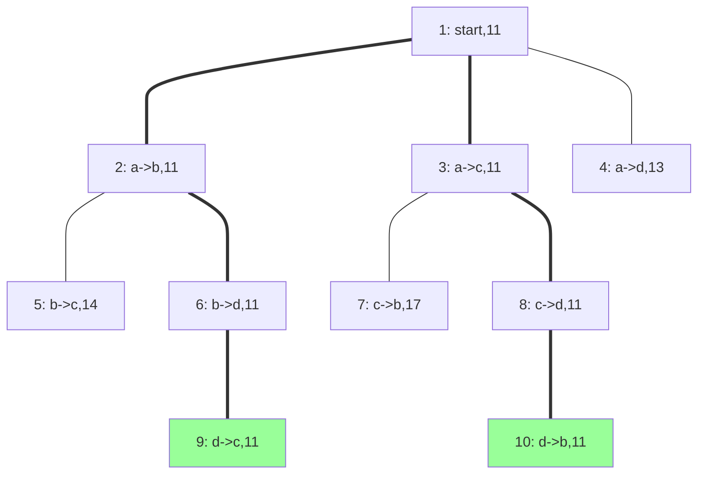
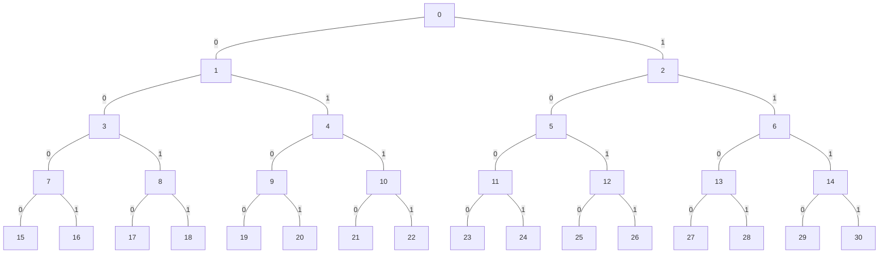

<!-- ```mermaid
graph TB
    1((1: ))==a===2((2: a))
    2==b===3((3: ab))
    3--d---4((4: abd))
    4--f---5((5: abdf))
    5--c---6((6: abdfc))

    5--g---7((7: abdfg))

    4--g---8((8: abdg))
    8--f---9((9: abdgf))
    9--c---10((10: abdgfc))

    8--e---11((11: abdge))

    3==e===12((12: abe))
    12==g===13((13: abeg))
    13==d===14((14: abegd))
    14==f===15((15: abegdf))
    15==c===16((16: abegdfc))
    16==a===17((17: abegdfca))

    13--f---18((18: abegf))
    18--d---19((19: abegfd))

    2==c===20((20: ac))
    20==f===21((21: acf))
    21--d---22((22: acfd))
    22--b---23((23: acfdb))
    23--e---24((24: acfdbe))

    22--g---25((25: acfdg))
    25--b---26((26: acfdgb))
    26--e---27((27: acfdgbe))
    
    21==g===28((28: acfg))
    28==d---29((29: acfgd))
    29--b---30((30: acfgdb))
    30--e---31((31: acfgdbe))

    28==e===32((32: acfge))
    32==b===33((33: acfgeb))
    33==d===34((34: acfgebd))
    34==a===35((35: acfgebda))

    2==d===36((36: ad))
    36--f---37((37: adf))
    37--c---38((38: adfc))

    36--g---39((39: adg))
    39--f---40((40: adgf))
    40--c---41((41: adgfc))
    
    39--b---42((42: adgb))
    42--e---43((43: adgbe))

    39--e---44((44: adge))
    44--b---45((45: adgeb))

    36==b===46((46: adb))
    46==e===47((47: adbe))
    47==g===48((48: adbeg))
    48==f===49((49: adbegf))
    49==c===50((50: adbegfc))
    50==a===51((51: adbegfca))

    2--f---52((52: af))
    52--c---53((53: afc))

    52--d---54((54: afd))
    54--b---55((55: afdb))
    55--g---56((56: afdbg))
    56--e---57((57: afdbge))

    55--e---58((58: afdbe))
    58--g---59((59: afdbeg))

    54--g---60((60: afdg))
    60--b---61((61: afdgb))
    61--e---62((62: afdgbe))

    60--e---63((63: afdge))
    63--b---64((64: afdgeb))

    style 17 fill:#99FF99
    style 35 fill:#99FF99
    style 51 fill:#99FF99
``` -->

### 3


### 4课本lb

### 4除去已选择的，剩下找最小的边lb

### 6
```cpp
class Solution {
public:
    int dx[4] = {0, 0, -1, 1};
    int dy[4] = {-1, 1, 0, 0};
    int m, n;
    int ans = 0;
    int temp = 0;
    void help(vector<vector<int>>& grid, vector<vector<bool>>& vis, int x, int y) {
        ans = max(ans, temp);
        // 出界
        if (x < 0 || y < 0 || x >= m || y >= n) {
            return;
        }
        // 没东西
        if (grid[x][y] == 0 || vis[x][y]) {
            return;
        }
        // 当前收获
        temp += grid[x][y];
        // 访问过
        vis[x][y] = true;
        // 遍历四个方向
        for (int i = 0; i < 4; ++i) {
            int new_x = x + dx[i];
            int new_y = y + dy[i];
            help(grid, vis, new_x, new_y);
        }
        vis[x][y] = false;
        temp -= grid[x][y];
    }
    int getMaximumGold(vector<vector<int>>& grid) {
        this->m = grid.size();
        this->n = grid[0].size();
        for (int i = 0; i < m; ++i) {
            for (int j = 0; j < n; ++j) {
                vector<vector<bool>> vis(m, vector<bool>(n, false));
                help(grid, vis, i, j);
            }
        }
        return ans;
    }
};
```
### 插棒
```
Algorithm triangle_problem(board[0...14])
    // 剪枝，当前步数大于13就不用继续了
    if count > 13 then
        return
    // 只剩下一个插棒结束递归
    num <- 0
    for i <- 0 to 14 do
        if board[i] = true then 
            num <- num + 1
    if num = 1 then
        record()
        return
    // 找出空位
    for i <- 0 to 14 do
        if board[i] = true then 
            continue
        
        // 从空位找到五个方向上的邻居的邻居
        for j <- 0 to 4 do 
            // 邻居的邻居
            new_empty = i + DIRECTION[j]
            // 出界或空位就跳过
            if new_empty < 0 or new_empty > 14 or board[new_empty] = true then
                continue
            // 得到i的邻居
            neighbor = i + NEIGHBOR[i]
            // 更新期盼
            board[i] <- true
            board[new_empty] <- false
            board[neighbor] <- false
            // 增加当前步数
            count <- count + 1
            // 进入递归函数
            triangle_problem(board)
            // 回溯
            board[i] <- false
            board[new_empty] <- true
            board[neighbor] <- true
            // 减少当前步数
            count <- count - 1

```
```
Algorithm triangle_problem(board[0...14])
    // 剪枝，当前步数大于13就不用继续了
    if count > 13 then
        return
    // 只剩下一个插棒结束递归
    num <- 0
    idx <- -1
    for i <- 0 to 14 do
        if board[i] = true then 
            num <- num + 1
            idx <- i
    if num = 1 then
        // 初始位置才记录
        if idx = INIT_LOCATION then
            record()
        return
    // 找出空位
    for i <- 0 to 14 do
        if board[i] = true then 
            continue
        
        // 从空位找到五个方向上的邻居的邻居
        for j <- 0 to 4 do 
            // 邻居的邻居
            new_empty = i + DIRECTION[j]
            // 出界或空位就跳过
            if new_empty < 0 or new_empty > 14 or board[new_empty] = true then
                continue
            // 得到i的邻居
            neighbor = i + NEIGHBOR[i]
            // 更新期盼
            board[i] <- true
            board[new_empty] <- false
            board[neighbor] <- false
            // 增加当前步数
            count <- count + 1
            // 进入递归函数
            triangle_problem(board)
            // 回溯
            board[i] <- false
            board[new_empty] <- true
            board[neighbor] <- true
            // 减少当前步数
            count <- count - 1

```
### 找零问题
```
Algorithm note_change(notes[0..n-1], target)
    // 用动态规划求解找零问题所有解
    // 输入：找零面额notes[0..n-1]，升序排列，找零目标target
    // 输出：面额为target的找零结果组合的集合
    // 首先构建状态表，初始化1至5元的最少张数组合
    ans[1] =[[0, 1, 0, 0, 0, 0]]
    ans[2] = [[0, 2, 0, 0, 0, 0]]
    ans[3] = [[0, 0, 0, 1, 0, 0]]
    ans[4] = [[0, 1, 0, 1, 0, 0]]
    ans[5] = [[0, 0, 0, 0, 0, 1]]
    // 从目前最大面额的下一个开始，直到目标面额
    for i <- note[n - 1] + 1 to target do
        temp <- ∞
        k <- 0
    // 找到最小组合张数temp，并记录组合的索引
    for j <- 1 to ⌊i / 2⌋ do
        cur <- count(ans[j]) + count(and[i - j])
        if cur < temp then
        temp <- cur
        idx[k] <- j
        k <- k + 1
    // 根据记录的索引更新状态表
    for j <- 0 to k do
        temp <- add(ans[idx[j]], ans[idx[i - j]])
        // 去重
        if temp not in ans[i]
            ans[i]中加入temp
    return ans[target]
Algorithm count(a[0..n - 1])
    // 输入：某一面额需要的面额组合
    // 输出：组合面额张数
    ans <- 0
    for i <- 0 to n - 1 do
        ans <- ans + a[i]
    return ans

Algorithm add(a[0..n - 1], b[0..n - 1])
    // 输入：a[0..n - 1]，b[0..n - 1]，两个面额需要的面额组合
    // 输出：所输入的两种面额组合的加合
    for i <- 0 to n - 1 do
        ans[i] = a[i] + b[i]
    return ans
```
