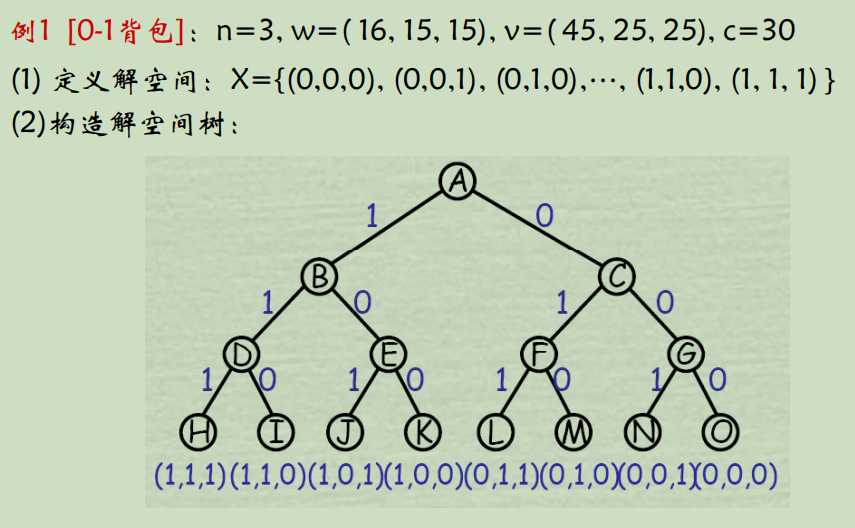
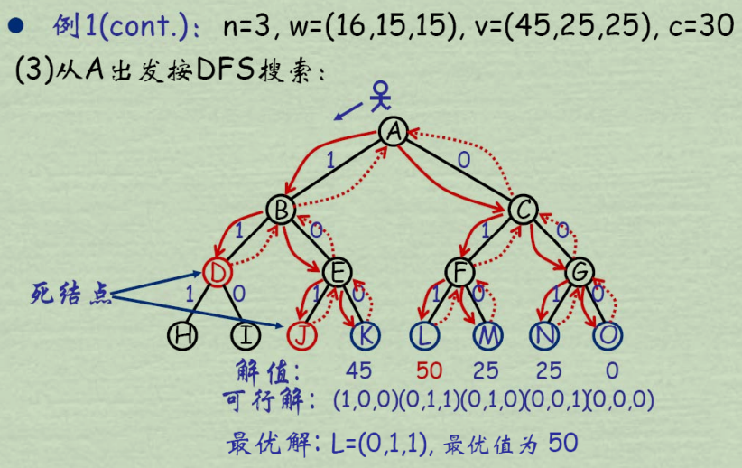
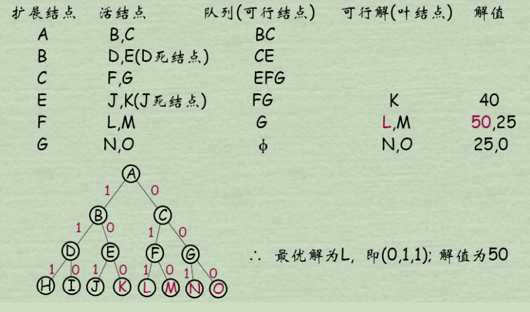
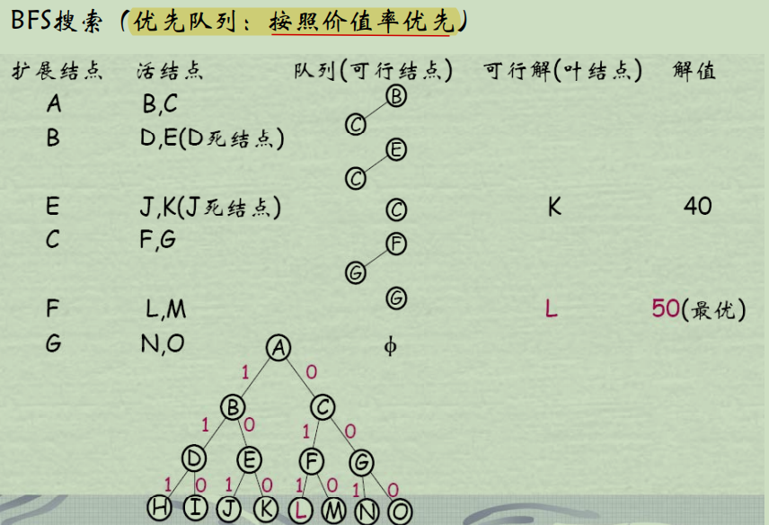
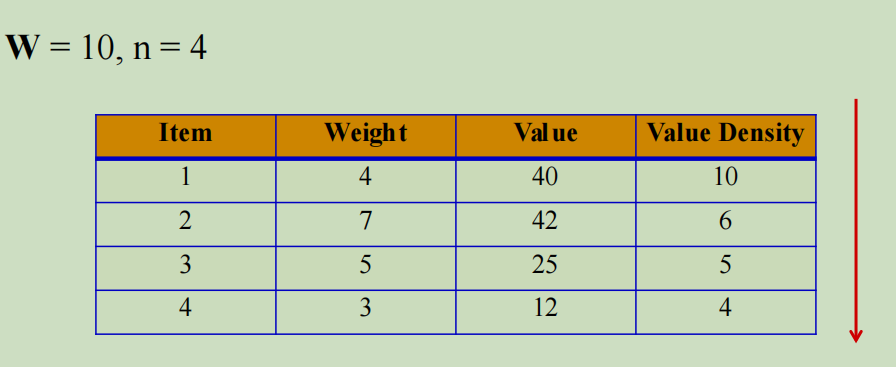
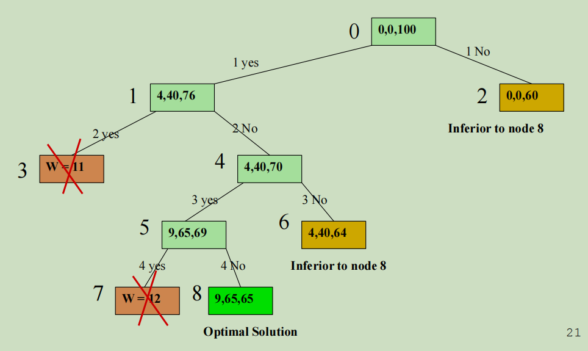
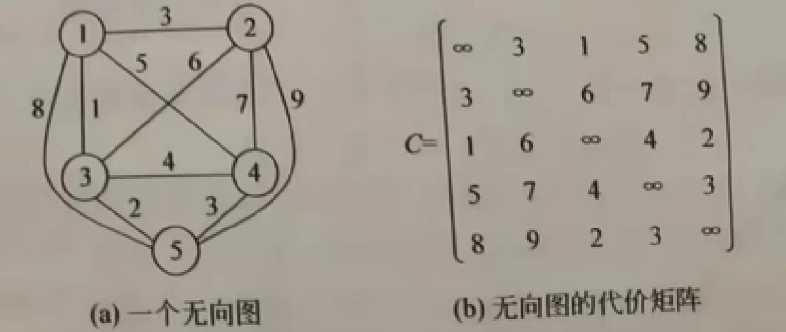
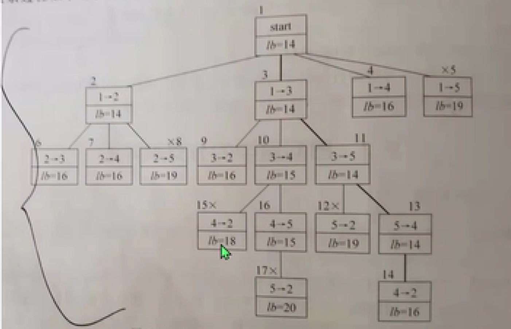

## Exhausting Search by Enumerating
## DFS and BFS
## Backtracking
### 方法概述
- 系统性
在包含问题的所有解的**解空间树**中，按照dfs的策略搜索
- 跳跃性
对于任一节点，判断以该节点为根的子树是否包含问题的解，若肯定不包含则跳过这个子树的搜索，逐层向其祖先节点回溯；否则进入子树继续按照dfs策略搜索
### 解空间
- 解向量
希望一个问题的解可以表示成为一个n元式$(x_1, x_2, x_3,.., x_n)$
- 显约束
对分量$x_i$的取值限定
- 隐约束
为满足问题的解而对**不同分量**之间施加的约束
- 解空间
对于问题的一个实例，解向量**满足显式约束**条件的所有多元组
- 解空间树(搜索过程就是找一个or一些特别的叶节点)
    - 根节点(搜索的节点，扩展节点)
    - 中间节点(非终端节点，扩展节点)
    - 叶节点(终端节点，解向量中的一个，死节点)
### 剪枝函数
- 约束函数
在扩展节点出减去不满足约束的子树，例如不满足题目的一些要求
- 限界函数
剪去得不到最优解的子树，例如当前的cost已经比当前ans要多了
### 常见的解空间树
- 子集树
  - $2^n$个叶子节点，$2^{n+1} - 1$个节点，遍历时间$\Omega(2^n)$
  - 例如：0-1背包问题，叶节点$2^n$，总节点$2^{n+1}$
  
  
  - 算法框架
  ```
  Backtrack(int t) {// 搜索到第i层
    if (t > n) {
        output(x);
        return;
    }
    while (all X_t) do {
        x[t] = X_t;
        if (Constraint(t) and Bound(t))
            Backtrack(t + 1);
    }
  }
  ```
  - n皇后问题
  ```cpp
  void NQueen(int idx) {// 到第idx层
    if (idx >= n) {
        print(x);
        return
    }
    for (int i = 0; i < n; ++i) {
        x[idx] = i;
        // 不冲突就下一层
        if (place_test(idx))
            NQueen(idx + 1);
    }
  }
  bool place_test(int idx) {
    // 检查和之前的摆放是否冲突
    for (int i = 0; i < idx; ++i) {
        if (x[i] == x[idx] || abs(x[i] = x[idx]) == abs(i - idx))
            return false;
    }
    return true;
  }
  ```
  - 0-1背包问题
  ```cpp
  /* 
      cur_weight: 当前重量
      cur_value: 当前价值
      best_value: 当前最优价值
      capacity: 背包容量
      x: 表示每个物品要不要的0-1数组
  */
  void KnapBacktrack(int idx) {
      if (idx >= n) {
          // 最后更新并输出
          best_value = max(best_value, cur_value);
          print(x);
          return;
      }
      // 要
      if (cur_weight + w[idx] <= capacity) {
          x[idx] = 1;
          cur_value += v[idx];
          cur_weight += w[idx];
          KnapBacktrack(idx + 1);
          cur_value -= v[idx];
          cur_weight -= w[idx];
      }
      // 不要
      x[idx] = 0;
      KnapBacktrack(idx + 1);
  }
  // 如果添加bound函数
  double bound(int idx, int cur_v, int cur_w) {
      double left_w = capacity - cur_w;
      double res = cur_v;
      // 先一个个装
      while (idx < n && w[i] <= left_w) {
          left_w -= w[idx];
          res += v[idx];
          ++idx;
      }
      // 装满背包
      if (idx < n)
          res += v[idx] / w[idx] * left_w;
      return res;
  }
  // 此前应该有个按照v大小的排序
  void KnapBacktrack(int idx) {
      if (idx >= n) {
          // 最后更新并输出
          best_value = max(best_value, cur_value);
          print(x);
          return;
      }
      // 要，对左子树限界
      if (cur_weight + w[idx] <= capacity && bound(idx, cur_value, cur_weight) > best_value) {
          x[idx] = 1;
          cur_value += v[idx];
          cur_weight += w[idx];
          KnapBacktrack(idx + 1);
          cur_value -= v[idx];
          cur_weight -= w[idx];
      }
      // 不要，对右子树限界
      if (bound(idx + 1, cur_value, cur_weight) > best_value) {
          x[idx] = 0;
          KnapBacktrack(idx + 1);
      }
      
  }
  ```
- 排列树
  - $n!$个叶节点，遍历时间$\Omega(n!)$
  - 例如：TSP问题
  
  - 算法框架
  ```
  Backtrack(int t) {// 搜索到第i层
    if (t > n) {
        output(x);
        return;
    }
    for i = t to n do {

        swap(x[t], x[i]);
        if (Constraint(t) and Bound(t))
            Backtrack(t + 1);
        swap(x[t], x[i]);
    }
  }
  ```
  - 求排列
  ```python
  def fun(idx):
    if idx >= n:
        print(x)
        return
    for i in range(idx, n):
        x[i], x[idx] = x[idx], x[i]
        fun(idx + 1)
        x[i], x[idx] = x[idx], x[i]
  
  n = 3
  x = [i for i in range(n)]
  fun(0)
  ```
  - TSP问题
  ```cpp
  ans = INT_MAX;// 最终cost
  temp_cost = 0;// 目前cost
  vecotr<vector<int>> grid(n + 1, vector<int>(n + 1));// 邻接矩阵
  vector<int> bestx;// 解路线
  x[n] = {0,1,2,...,n - 1, n};// 对这个进行全排列，从而得到所有路线
  void TSPBacktrack(int idx) {
    if (idx > n) {
        // 从最后一个点回到第一个点
        if (grid[x[n]][1] != 0 && temp_cost + grid[x[n]][1] < ans) {
          ans = temp_cost;
          bestx = x;
        }
        return;
    }
        
    
    // 从第idx层往后排序
    for (int i = idx; i <= n; ++i) {
        // 对f(x)的限界函数
        // 检查上一个节点idx - 1到将要去的节点i
        if (temp_cost + grid[x[idx - 1]][x[i]] >= ans)
            continue;
        swap(x[idx], x[i]);
        temp_cost += grid[x[idx - 1]][x[idx]];
        TSPBacktrack(idx + 1);
        temp_cost -= grid[x[idx - 1]][x[idx]];
        swap(x[idx], x[i]);
    }
  }
  ```
### 动态
动态产生问题的解空间，在任何时刻，算法只保留从根节点到当前扩展结点的路径，如果根到当前最长路径为h(n)，则回溯所需的计算控件为$O(h(n))$；相比于显式地存储整个解空间则需要$O(2^{h(n)})$or$O(h(n)!)$
### 效率分析
关于以下因素
- 产生x[idx]的时间
- 满足显约束x[idx]值的个数
- 计算constraint的时间
- 计算bound时间
- 满足constraint和bound的所有x的个数
好的约束函数能显著减少节点数，但计算量大，折衷
## Branch & Bound
### 基本思想
- 广度优先or最小耗费(最大效益)优先->队列or优先队列
- 为了有效选择下一个扩展结点，在每一活结点处计算优先值，根据已经计算的优先值选择最有利的
### 方法概述
- 定义解空间
- 确定树结构
- BSF方式搜索
  - 每个活结点**仅有一次**机会变成扩展结点
  - 由扩展结点生成可到达的新节点
  - 在新节点中**限界**删除
  - 剩余加入队列
  - 队列中选择扩展节点**分支策略**
  - 直到空为止
### 问题举例
- 0-1背包问题
物品数量n = 3 重量w = (20, 15, 15) 价值v = (40, 25, 25) 背包容量c = 30<br/>需要对输入数据物品**价值密度**从大到小排列
  - 用FIFO队列求解
  
  这里死节点为超重
  - 用优先队列求解，优先级为up_bound(UB)
  
  - bound
    - 直接用最大的密度
    
    
    注意每次取哪个扩展结点看哪个UB最大，取到一个了就一次性把子节点产生出来
    - 一个个放，最后放不下了再用密度

- 装载问题
有一批n个集装箱装上2载重c1，c2的船，一定能装上，求最优方案 -> 将一艘船尽可能装满(只有重量的0-1背包问题，每个物品价值为1)
- TSP问题
  - 算法
    用**贪心求出上界**，一个可能的局部解，取邻接矩阵每行最小两个值作为一入一出，加合除以二向上取整求出**下界lb**(每个节点都算lb)
  - example
    
    可以算出还没出发的第一个节点[14, 16]
    
    每个树状态节点通过已经确定了的边，找该行最小的还没确定的边求得lb
    - lb > 上界就没必要再找下去了
    - lb = 上界但还没到底也不用找
  - 代码
  ```cpp
  struct node{
      int from, to;
      int lb;
  };
  bool operator<(const node& a, const node& b) {
      return a.lb < b.lb;
  }
  bool operator>(const node& a, const node& b) {
      return a.lb > b.lb;
  }
  // graph[i][j] 存储城市i到城市j的距离，graph[i][i] = 0, 到不了位INF
  void BB(vector<vector<int>>& graph, int start) {
      int n = graph.size();
      priority_queue<node> q;
      // 求上界
      vector<bool> vis(n, false);
      int cur = start;
      int up_bound = 0;
      for (int k = 0; i < n - 1; ++k) {
          vis[cur] = true;
          int to_target_idx = -1;
          int to_cost_min = INF;
          for (int i = 0; i < n; ++i) {
              if (vis[i])
                  continue;
              if (graph[cur][i] < to_cost_min) {
                  to_cost_min = graph[cur][i];
                  to_target_idx = i;
              }
          }
          up_bound += to_cost_min;
          cur = to_target_idx;
      }
      // 最后回到start
      up_bound += graph[cur][start];

      vector<bool> vis2(n, false);
      // 优先队列
      q.emplace(node{start, start, get_lb()});
      while (!q.emtpy()) {
          node temp = q.top();
          q.pop();

          for (int i = 0; i < n; ++i) {
              if (vis[i])
                  continue;
              // lb函数剪枝...
          }
      }
  }
  ```
### B&B and Backtracking比较
- 求解目标
  - 回溯法-所有解
  - 分支限界法-尽快找出一个解
- 搜索方法
  - dfs
  - bfs or 最佳优先方法
- 扩展方式
  - 分支限界法中仅有一次机会成为扩展结点。活结点一次性产生其所有儿子
- 存储空间
  - 分支限界法要求更大