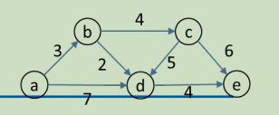
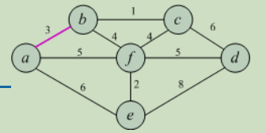
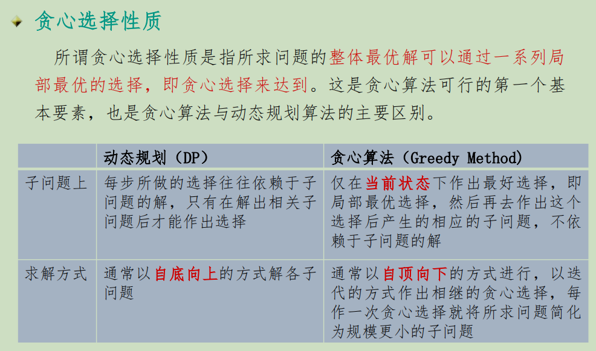
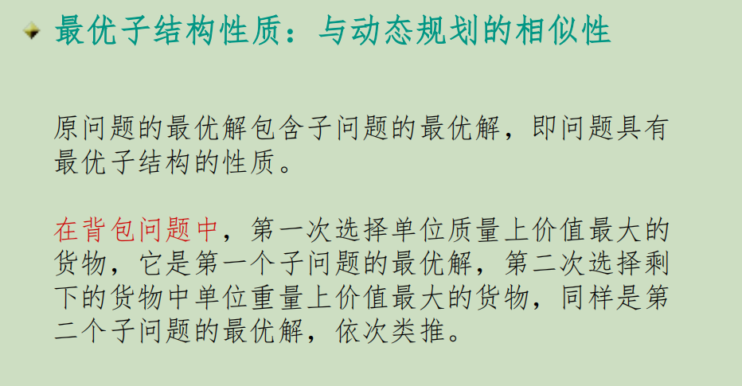

## Greedy Algorithm
### Greedy Strategy
A greedy algorithm makes a **locally optimal choice** step by step <u>in the hope</u> that a sequence of such choice will lead to a **globally optimal solution**
- 每一步的选择需要满足的条件
  - 可行Feasible
  - 局部最优Loacally optimal
  - 不可撤销Irrevocable
贪心选择性质：若原问题的整体最优解可以**通过一系列局部最优的选择**得到，即贪心选择来达到
### 分类
- 最优
  - MST
  - 单源最短路径
  - Huffman编码
  - 分数背包问题
- 尽快的近似
  - TSP
  - 背包问题
- 近似
  - 找零
### example
#### 分数背包问题
选择物品i装入背包时，可以选择物品i的一部分，而不一定要全部装入背包
- 度量标准
  - 每装入一件物品，使背包获得**最大的价值**增量
    处理规则
      - 按照物品的**价值非增**次序将物品一件件放入背包
      - 如果放不进去，就装一部分
  - 以容量为度量标准
    处理规则
      - 按照物品**重量的非降**次序将物品装入背包
      - 如果放不进去，就装一部分
  - 单位重量价值增量
    既考虑了价值也考虑了容量，唯一正确的
    处理规则：
      - 按照物品的**单位利益值：$v_i / w_i$的比值的非增次序**装入
      - 如果放不进去，就装一部分
- 效率分析
  - 排序$O(nlogn)$ + 依次放入物品$O(n)$
  - 因此最终时间上界为$O(nlogn)$
#### 单源最短路径
Dijkstra算法，不能用于负权重的边的图
idea of Dijkstra
  - vertex分类，有最短路径的和没有最短路径的
  
  dis 数组变化
  - 从a开始`[3, inf, 7, inf]`
  - 选择**最小(贪心)**的没选过的b的3，看从b能到达哪个vertex比当前更短，可以更新c、d：`[3, 3 + 4, 3 + 2， inf]`即`[3, 7, 5, inf]`
  - 选择**最小(贪心)**的没选过的d，看从d能到达那个vertext比当前更短，可以更新e：`[3, 7, 5, 5 + 4]`即`[3, 7, 5, 9]`
  - 选择**最小(贪心)**的没选过的c，看从c能到达那个vertext比当前更短，好像更长了就不更新了
  - 依次类推，直到找完这n - 1个
#### MST
#### Kruskal
idea
  - 边集按照权值大小排序
  - 依次(贪心)从边集中选择边加入，同时利用并查集保证没有回路，有回路就不要这条边下一个，直到选出n - 1条边
#### Prim
idea
    每次添加一个vertex，形成超级节点从而更新节点里面中相连的权值最小
  
  这个时候数组不是之前Dijk的a到所有点的最短路径，而是**一条边**
  - 从a开始`[3, inf, inf, 6, 5]`
  - 找最小的没找过的b 3，更新c、f，`[3, 1, inf, 6, 4]`
  - 找最小的没找过的c 1，更新d，`[3, 1, 6, 6, 4]`
  - 找最小的没找过的f 4，更新d、e，`[3, 1, 5, 2, 4]`
  - 依次类推，直到找完剩下n - 1个vertex
### 比较
#### 01背包v.s.分数背包
- 对于0-1背包问题，贪心选择**不能**得到最优解，但是动态规划可以
    是因为在这种情况下，它无法保证最终能将背包装满，部分闲置的背包空间使每公斤背包空间的价值降低了
- 动态规划算法可以有效地解0-1背包问题
    处理0-1背包问题时，应比较选择该物品和不选择该物品所导致的最终方案，然后再作出最好选择。最终方案是由许多重叠的子问题的解构成。这正是该问题可用动态规划算法求解的另一重要特征。
#### DP v.s. Greedy Algorithm

