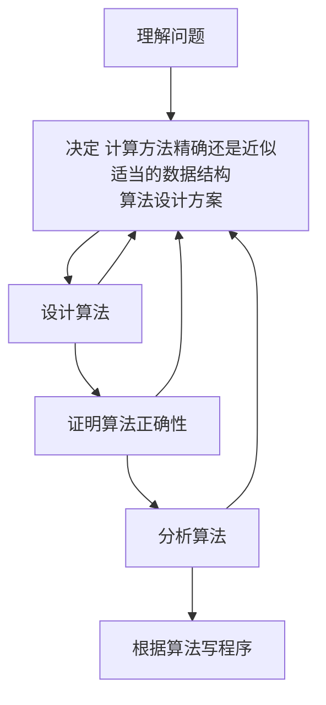
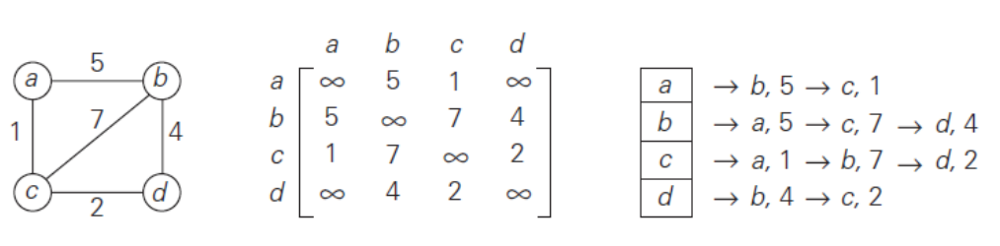
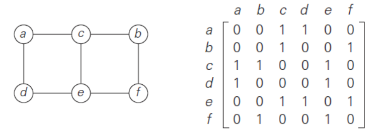
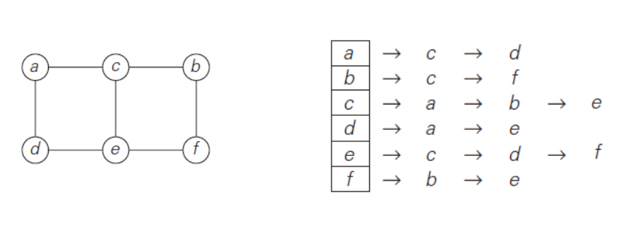

## 引言
### 算法
**算法是一系列解决问题的明确指令，也就是说，对于符合一定规范的输入，能够在有限时间内获得要求的输出。**
性质
- **输入**
- **输出**
- __有穷性__
- **确定性**
  - 不符合确定性的运算
    - 5/0
    - 将6或7与x相加
    - 未赋值的变量参与运算
**算法可以用自然语言、伪代码表示或计算机程序实现**
### 例子
#### 求最小公因数
##### Euclid算法
```
Algorithm Euclid(m, n)
    while n != 0 do
        r <- m mod n
        m <- n
        n <- r
    return m
```
##### Consecutive Integer Algorithm 连续整数检测算法
从较小的一个数开始向下枚举
```
Algorithm ConsecutiveInteger(m, n)
    // 输入：两个不全为0的非负整数
    // 输出：m, n的最大公约数
    if n = 0 return m
    t = min{m, n}
    while t > 0 do
        if (m mod t = 0) and (n mod t) = 0
            return t
        else
            t <- t - 1
    return t 
```
#### Sieve of Eratosthenes (埃拉托色尼筛选法)，产生一个不大于给定整数n的连续质数序列
```
Algorithm Sieve(n)
    // 初始化候选数组
    for p <- 2 to n do A[p] <- p
    // 遍历可能是合数的因数
    for p <- 2 to [n^(1/2)] do 
        // 还没被消除
        if A[p] != 0
            // 不管p是不是质数，p*p肯定合数
            j <- p * p
            while j <= n do
                A[j] <- 0
                // 不断加上p的所有合数
                j <- j + p
    // 赋值给结果数组
    i <- 0
    for p <- 2 to n do
        if A[p] != 0
            L[i] <- A[p]
            i <- i + 1
    return L
```
### 算法设计与分析过程
**好的算法常常是不懈努力和反复修改的结果**

### Important problem types
- 排序
- 查找
- 字符串处理
- 图
  - 遍历
  - 最短路径
  - 拓扑排序
  - TSP
  - 图填色问题
- 组合问题
- 集合问题
  - 最近邻对
  - 凸包问题
- 数值问题
  - 解方程
  - 定积分
  - 评估函数
### 数据结构
**算法操作的是数据，所以数据结构很重要**
- 链表
- stack
- queue
- graph(注意无向图的边记录两遍，加权图和无权图的对角线)
    
  - 邻接矩阵
    
  - 邻接链表
    
- tree
  - rooted tree 除了根节点，其他节点都有一个确定的父节点
  - ordered tree 兄弟之间有序
- set and dictionary