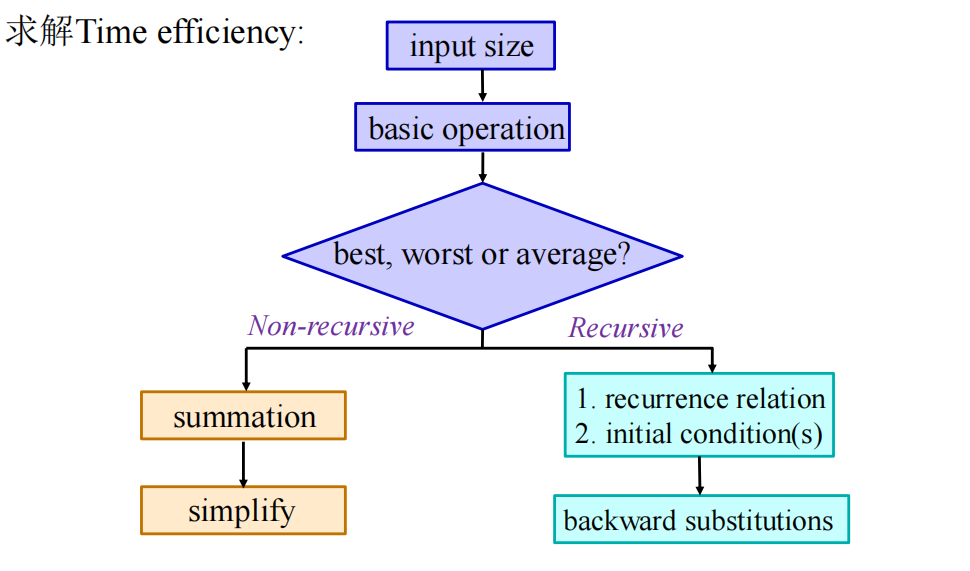

## 分析算法效率基础
input size -> N
input type -> I
algorithm function -> A
算法效率包括
- Time efficiency T(N, I)
- Space efficiency S(N, I)
### 一些公式
#### 斐波那契数列
$F_n = C_1(\frac{1 + \sqrt{5}}{2})^n + C_2(\frac{1 - \sqrt{5}}{2})^n$
$1 + 2^2 + 3^3 + ... + n^2 = \frac{n(n + 1)(2n + 1)}{6}$
### 分析框架
- Measure an input's size
- Units for measuring running time
  **count basic operation**
    - 排序，key的比较
    - 四则运算，乘除法
    - 每次循环都会进行的
- Orders of growth of the algorithm's efficiency function
    常见的
    $1 < log_2{n} < n < nlog_2{n} < n^2 < n^3 < 2^n < 3^n$
    $log{n} < n^{\alpha} < a^n < n! < n^n$
    **有些可能不连续的都有**
- **Worst-case, best-case and average-case** efficiency
    使得算法运行得最快/慢的规模均为n的输入
    注意平均并不是最坏和最好的平均，而是出现概率的平均$T_{avg}(n) = \sum_{size(l) = n}p(I)T(I)$
    eg. 顺序搜索
    $T_{avg}(n) \\
    = \sum_{size(l) = n}p(I)T(I) \\
    = (\frac{p}{n} \cdot 1 + \frac{p}{n} \cdot 2 + ... + \frac{p}{n} \cdot n) + n \cdot (1 - p)
    $
### Asymptotic notations 渐进符号
- $O(g(n))$: <= g(n)
- $\Omega(g(n))$: >= g(n)
- $\Theta(g(n))$: = g(n)
- $o(g(n))$: < g(n)
- $\omega(g(n))$: > g(n)
#### formal definition
- $t(n) \in O(g(n))$
存在$n_0, c$，对于所有n > $n_0$，都有$t(n) <= cg(n)$
eg.
    - $10n^2 \in O(n^2)$
    - $10n \in O(n^2)$
- $t(n) \in \Omega(g(n))$
存在$n_0, c$，对于所有n > $n_0$，都有$t(n) >= cg(n)$
eg.
    - $10n^2 \in \Omega(n^2)$
    - $10n^3 \in \Omega(n^2)$
    - $2^n \in \Omega(n^2)$
- $t(n) \in \Theta(g(n))$
存在$n_0, c_1, c_2$，对于所有n > $n_0$，都有$c_1g(n) <= t(n) <= c_2g(n)$
eg.
    - $10n^2 \in \Theta(n^2)$
#### properties
- $f(n) \in O(f(n))$
- $f(n) \in O(g(n)), g(n) \in O(h(n)) => f(n) \in O(h(n))$
- $f(n) \in O(g(n)) <=> g(n) \in \Omega(f(n))$
- $f(n) \in \Theta(g(n)) <=> g(n) \in \Theta(f(n))$
- $O(g_1(n)) + O(g_2(n)) = O(g_1(n) + g_2(n))$
- $O(g_1(n)) \cdot O(g_2(n)) = O(g_1(n) \cdot g_2(n))$
- $O(cf(n)) = O(f(n))$
- $g(n) = O(f(n)) => O(f(n)) + O(g(n)) = O(f(n))$
#### 求极限判断哪个大 前提是连续函数
#### 步骤
##### 非递归
- input size
- basic operation
- worst, average, and best case
- set up summation for C(n) reflecting the number of times the algorithm’s basic operation is executed(基本运算的次数总和)
- asymptotic notation
###### 找最大元素
```
algorithm MaxElement(A[0..n-1])
    maxval <- A[0]
    for i <- i to n - 1 do
        if A[i] > maxval
            maxval <- A[i]
    return maxval
```
input size: n
basic operation: `A[i] > maxval` operate every time
check: as for every array whose size is n, the number of comparisons is the same. Thus, we don't have to distinguish these cases
time efficiency: $C(n) = \sum^{n-1}_{i=1}1 = n - 1 \in \Theta(n)$
###### 是否有重复元素
```
algorithm uniqueElements(A[0..n-1])
    for i <- 0 to n - 2 do
        for j <- i + 1 to n - 1 do
            if A[i] = A[j] return false
    return true
```
input size: array length n
basic operation: `A[i] = A[j]` comparison operation
check: 
    - worst case
    没有重复的，遍历完
    $C_{worst}(n) = \sum^{n-2}_{i=0}\sum^{n-1}_{j=i+1}1 = \frac{n(n-1)}{2} \in \Theta(n^2)$
...
##### 矩阵乘法
$O(n^3)$
##### 二进制有多少位
```
algorithm Binary(n)
    count <- 1
    whill n > 1 do
        count <- count + 1
        n <- [n / 2]
    return count
```
input size: n
basic operation: 最频繁的操作是决定是否执行循环体的`n > 1`
每次循环执行，n都会减半，次数大约$log_2n$
精确计算为$\lfloor log_2n \rfloor + 1$
##### 递归
- input size
- basic operation
- worst, average, and best case
- set up a *recurrence relation* and *initial condition(s)* and 算基本运算的次数总和
- 解出递推关系
###### n!
```
algorithm F(n)
    if n = 0 do return 1
    else return F(n - 1)*n
```
input size: n
basic operation: 乘法
check: 都一样
$M(n) = M(n - 1) + 1, M(0) = 0$
=> $M(n) = n$
###### hanoi
input: n
basic operation: moving one disk
check: 都一样
$M(n) = M(n - 1) + 1 + M(n - 1), M(1) = 1$
=> $M(n) = 2^n - 1$
### summary
