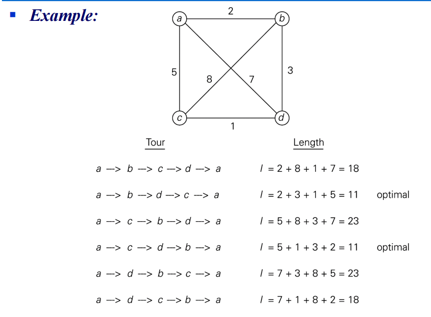
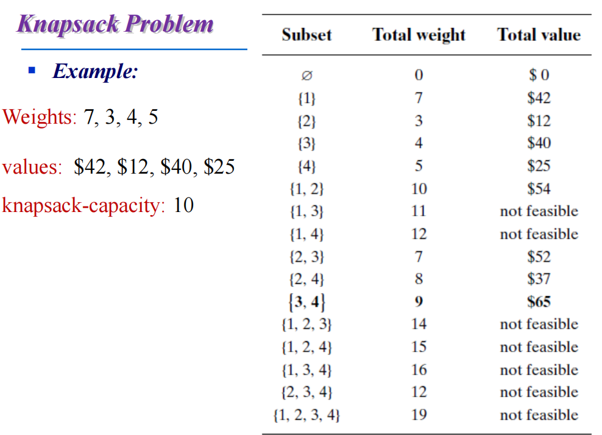

### brute force
- 优点：广泛适用性和简单性
- 缺点：大多效率低
- 为改进算法提供比较依据，准绳
### 例子
- 选择排序
- 冒泡排序
- 顺序查找
- 字符串匹配
- 穷举查找
### NP-hard Problem
- 旅行商问题
    寻找哈密顿回路(顶点) $(n - 1)!$ -> $O(n!)$
    
- 01背包问题，$2^n$ 种组合
    
    -  $dp[i][j]$:表示所有选法集合中,**只从前i个物品中选**,并且总体积不大于j的选法的集合,它的值是这个集合中每一个选法的最大值。
    - 状态转移方程，拿不拿第i个物品：$dp[i][j] = max(dp[i - 1][j], dp[i - 1][j - v[i]] + w[i])$
    - 初始化：
        - 若背包容量为0，背包价值总和一定为0，即$dp[i][0] = 0$
        - 存放编号0的物品的时候，各个容量的背包所能存放的最大价值，即
        ```cpp
        for(int i = weight[0]; i < bagWeight; ++i) {
            dp[0][j] = value[0];
        }
        ```
        - 其他地方都是0了，但注意若价值有负数，需要初始化为$-\infty$
        - 最终初始化代码
        ```cpp
        vector<vector<int>> dp(weight.size() + 1, vector<int>(bagWeight + 1, 0));
        for (int j = weight[0]; j <= bagWeight; j++) {
            dp[0][j] = value[0];
        }
        ```
    - 先遍历物品，再遍历背包重量
    ```cpp
    // weight数组的大小就是物品的个数
    for (int i = 1; i < weight.size(); ++i) {
        for (int j = 0; j <= bagWeight; ++j) {
            // 不够放第i个物品了
            if (j < weight[i])
                dp[i][j] = dp[i - 1][j];
            // 够放就求放不放的最大值
            else
                dp[i][j] = max(dp[i - 1][j], dp[i - 1][j - weight[i]] + value[i]);
        }
    }
    ```
    - 状态压缩：上一层dp[i - 1]状态更新完成之后就么用了，于是不如只用一层数组  
        - 状态转移方程： `dp[j] = max(dp[j], dp[j - weight[i]] + value[i]);`
        - 遍历
        ```cpp
        for (int i = 0; i < weight.size(); ++i ) {
            // 所以从后往前循环，每次取得状态不会和之前取得状态重合，保证物品i只被放入一次？？
            for (int j = bagWeight; j >= weight[i]; --j) {
                dp[j] = max(dp[j], dp[j - weight[i]] + value[i]);
            }
        }
        ```
    - 延申[背包九讲](https://blog.csdn.net/qq_52354698/article/details/122508598)

- 分配问题，n个人n个工作，给出每个人对应每个工作的要价，帮助资本家找出花费最少的组合 $n!$