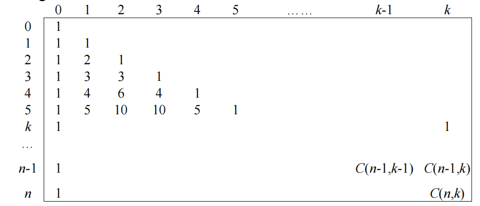
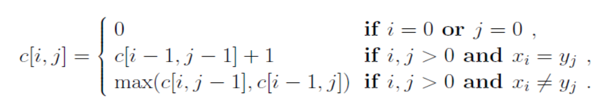

## 动态规划
### basic concepts
- 最优化原理
把多阶段过程转化为一系列单阶段问题，逐个求解，创立了解决这类过程优化问题的新方法—动态规划
- 多段决策问题(MDP)
求解的问题可以划分为一系列**相互联系的阶段，在每个阶段都需要作出决策，且一个阶段决策的选择会影响下一个阶段的决策**，从而影响整个过程的活动路线，求解的目标是选择各个阶段的决策使整个过程达到最优
- DP for optimizing MDP
- DP
用于求解**以时间划分阶段的动态过程的优化问题**，与时间无关的，可以人为地引进时间因素
  - **阶段(Stage)**
  把所给的问题的求解过程恰当地划分为**若干个相互联系**的阶段。
  - **状态(State)**
  表示每个阶段开始时，问题或系统所处的客观状况。状态既是该阶段的某个起点，又是前一个阶段的某个终点。通常一个阶段有若干个状态。
      - 无后效性
      如果某阶段状态给定后，则**该阶段以后过程的发展不受该阶段以前**各阶段状态的影响，也就是说状态具有马尔科夫性。  
  - **策略(Policy)**
  各个阶段决策的确定后，就组成了一个决策序列，该序列称之为一个策略。由某个阶段开始到终止阶段的过程称为子过程，其对应的某个策略称为子策略。
- Bellman最优性原理
求解问题的一个最优策略序列时，该最优策略序列的**子策略序列总是最优的**
- 和分治法的异同
    - 相同
    **分解**成若干个子问题，**先求子问题**，再从这些子问题的解得到原问题的解
    - 不同
    DP的子问题往往**不是相互独立** -> 用一个表记录已解的所有子问题的答案，避免重复计算
- **思想实质**
  - 分治和解决冗余
- 解题步骤
    - <font color='red'>找出最优解的性质，刻画结构特征</font>
    - <font color='red'>递归的定义最优值(动态规划方程)</font>
    - <font color='red'>自底向上或自顶向下计算最优值</font>
        - 自顶向下：备忘录法
        ```cpp
        int Fib(int n) {
            if (n <= 0) {
                return n;
            }
            // 初始化为-1表示没有计算过
            vector<int> memo(n + 1, -1);
            return fib(n, Memo);
        }
        int fib(int n, vecotr<int> memo) {
            // 计算过了直接返回
            if (memo[n] != -1) {
                return memo[n];
            }
            // 开始计算
            if (n <= 2) {
                memo[n] = 1;
            }
            // 递归填写memo备忘录
            else {
                memo[n] = fib(n - 1, memo) + fib(n - 2, memo);
            }
            return memo[n];
        }
        ```
        - 自底向上：
        ```cpp
        int fib(int n ) {
            if (n <= 0)
                return n;
            vector<int> memo(n + 1);
            memo[0] = 0;
            memo[1] = 1;
            for (int i = 2; i <= n; ++i) {
                memo[i] = memo[i - 1] + memo[i - 2];
            }
            return memo[i];
        }
        ```
    - <font color='red'>计算最优值时候记录信息，构造最优解</font>

### condition
- 依赖问题本身具有两个重要的适用性质
    - **最优子结构**
    如果问题的最优解是由其子问题的最优解来构造，则称该问题具有最优子结构性质
    - **重叠子问题**
    使用递归算法的时反复求解相同的子问题，不停的调用函数，而**不是生成新的子问题**
### application
- 二项式系数
    - C(n, k)第n行第k个
    
    ```
    ALGORITHM Binominal (n,k)
    for i = 0 to n do
        for j = 0 to min (i, k) do
            // 第一个最后一个都是1
            if j = 0 or j = i
                BiCoeff [i, j] = 1
            else
                BiCoeff [i, j] = BiCoeff [i-1, j-1] + BiCoeff [i-1, j]
    return BiCoeff [n, k]
    ```
- LCS(Longest Common Subsequence)
    - 公共子序列，不必一定连在一起
    
    - 想找出最优解，标记，然后从答案往前推
    ```
    LCS_Length(X, Y)
        m <- length[X]
        n <- length[Y]
        for i <- 0 to m
            do c[i, 0] <- 0
        for j <- 0 to n
            do c[0, j] <- 0
        
        for i <- 1 to m
            do for j <- 1 to n
                do if x_i = y_j then 
                    c[i, j] <- c[i - 1, j - 1] + 1
                    b[i, j] <- '斜'
                else if c[i - 1, j] >= c[i, j - 1] then
                    c[i, j] <- c[i - 1, j]
                    b[i, j] <- '上'
                else
                    c[i, j] <- c[i, j - 1]
                    b[i, j] <- '左'
        return c and b
    ```
### Dynamic Matrix Multiplication
- 对于一序列矩阵的相乘，在不同乘法次序中，想要找到最少的乘法次数
- 构造数组`A[n + 1][n + 1]`，其中`A[i][j]`表示第i个矩阵到第j个矩阵最少乘法次数
- 默认初始化为最大值，对角线初始化为0(自己和自己不用乘)
```cpp
// 有i个矩阵相乘
for (int i = 2; i <= n; ++i) {
    // 从第j个矩阵开始
    for (int j = 1; j <= n - i + 1; j++) {
        dp[i][j] = INT_MAX;
        // 遍历中间所有的第k个矩阵相乘
        for (int k = j + 1; k < i + j - 1; ++k)
        // Ai_k * Ak+1_j
        dp[i][j] = min(dp[i][j], m[i][k] + m[k + 1][j] + p[i - 1] * p[k] * p[j])
    }
}
```
- 遍历时记录更新断点，求解
```cpp
// 有i个矩阵相乘
for (int i = 2; i <= n; ++i) {
    // 从第j个矩阵开始
    for (int j = 1; j <= n - i + 1; j++) {
        dp[i][j] = INT_MAX;
        // 遍历中间所有的第k个矩阵相乘
        for (int k = j + 1; k < i + j - 1; ++k)
        // Ai_k * Ak+1_j
        int temp = m[i][k] + m[k + 1][j] + p[i - 1] * p[k] * p[j];
        if (temp < dp[i][j]) {
            dp[i][j] = temp;
            // 记录断点
            s[i][j] = k;
        }
    }
}
void print_optimal(int** s, int i, int j) {
    if (i == j) {
        cout << "A" << i;
        return;
    }
    cout << "(";
    print_optimal(s, i, s[i][j]);
    print_optimal(s, s[i][j] + 1, j);
    cout << ")";
}
```
### 0-1背包问题
- 代码
```cpp
    // 先固定物品个数i，遍历每种背包重量j
    // weight数组的大小就是物品的个数
    for (int i = 0; i < weight.size(); ++i) {
        for (int j = 0; j <= bagCapacity; ++j) {
            // 不够放第i个物品了
            if (j < weight[i])
                dp[i][j] = dp[i - 1][j];
            // 够放就求放不放的最大值
            else
                dp[i][j] = max(dp[i - 1][j], dp[i - 1][j - weight[i]] + value[i]);
        }
    }
    // 滚动数组空间压缩，实际上每一层的状态更新只需要用到上一层的记录
    // 记录每个背包容量能装的最优值
    vector<int> dp(bagCapacity + 1, 0);
    for (int i = 1; i <= weight.size(); ++i) {
        // 从大到小更新，因为要用到未更新的左边的上一层信息
        for (int j = bagCapacity; j >= 0; --j) {
            dp[j] = max(dp[j], dp[j - weight[i]] + value[i]);
        }
    }


    // 记忆法
    // 全局dp数组，-1
    vector<vector<int>> dp(weight.size() + 1, vector<int>(bagCapacity + 1, -1))
    // 初始值
    for (int i = 0; i < dp.size(); ++i) {
        dp[i][0] = 0;
    }
    for (int j = 0; j < dp[0].size(); ++j) {
        dp[0][j] = 0;
    }
    int MFKnapsack(int i, int j) {
        // 已经计算过，直接返回
        if (dp[i][j] != -1) 
            return dp[i][j];

        // 装不下
        if (j < weight[i])
            dp[i][j] = dp[i - 1][j];
        // 装得下
        else
            dp[i][j] = max(dp[i - 1][j], MFKnapsack(i - 1, j - weight[i]) + value[i]);
        
        return dp[i][j];
    }
    // 调用
    MFKnapsack(weight.size() - 1, bagCapacity);
```
- <font color='purple'>填表dp</font>
- `dp[i][j] = max(dp[i - 1][j], dp[i - 1][j - weight[i]] + value[i])`
- `i - 1`为前几个物品都放好了，`j`表示在不同容量的背包里
- `dp[i][j] = dp[i - 1][j]`从上面下来
- `dp[i][j] = dp[i - 1][j - weight[i]] + value[i]`上一行向左移动这个物体得重量个格子

| item | weight | value |
|:--: | :--: | :--: |
| 1 | 2 | $12 |
| 2 | 1 | $10 |
| 3 | 3 | $20 |
| 4 | 2 | $15 |

- 一行一行填写，对于第一个item，第一个包装不下0，第二个才可以装12，由于前面没装，之后都填12

| i | 0 | 1 | 2 | 3 | 4 | 5 |
|:--: | :--: | :--: | :--: | :--: | :--: | :--: |
| 0 | 0 | 0 | 0 | 0 | 0 | 0 |
| 1 | 0 | <b>0</b> | <b>12</b> | <b>12</b> | <b>12</b> | <b>12</b> |
| 2 | 0 |
| 3 | 0 |
| 4 | 0 |

- 对于第二个item，value = 10，weight = 1
    - 背包容量1：装得下
        - 装`dp[2 - 1][1 - 1] + 10 = 10`
        - 不装`dp[2 - 1][1] = 0`
    - 背包容量2：装得下
        - 装`dp[2 - 1][2 - 1] + 10 = 10`
        - 不装`dp[2 - 1][2] = 12`
    - 以此类推

| i | 0 | 1 | 2 | 3 | 4 | 5 |
|:--: | :--: | :--: | :--: | :--: | :--: | :--: |
| 0 | 0 | 0 | 0 | 0 | 0 | 0 |
| 1 | 0 | 0 | 12 | 12 | 12 | 12 | 
| 2 | 0 | <b>10</b> | <b>12</b> | <b>22</b> | <b>22</b> | <b>22</b> |
| 3 | 0 |
| 4 | 0 |

- 对于第三个item，value = 20， weight = 3
    - 背包容量1：装不下从上面下来
    - 背包容量2：装不下从上面下来
    - 背包容量3：装得下
        - 装`dp[3 - 1][3 - 3] + 20 = 20`
        - 不装`dp[3 - 1][3] = 22`
    - 背包容量4：装的下
        - 装`dp[3 - 1][4 - 3] + 20 = 30`
        - 不装从上面下来22
    - 背包容量5：装的下
        - 装`dp[3 - 1][5 - 3] + 20 = 32`
        - 不装22

| i | 0 | 1 | 2 | 3 | 4 | 5 |
|:--: | :--: | :--: | :--: | :--: | :--: | :--: |
| 0 | 0 | 0 | 0 | 0 | 0 | 0 |
| 1 | 0 | 0 | 12 | 12 | 12 | 12 | 
| 2 | 0 | 10 | 12 | 22 | 22 | 22 |
| 3 | 0 | <b>10</b> | <b>12</b> | <b>22</b> | <b>30</b> | <b>32</b> |
| 4 | 0 |

- 对于第四个item，value = 15， weight = 2
    - 背包容量1：装不下从上面下来
    - 背包容量2：装得下
        - 装`dp[4 - 1][2 - 2] + 15 = 15`
        - 不装上面下来12
    - 背包容量3：装得下
        - 装`dp[3 - 1][3 - 2] + 15 = 25`
        - 不装上面下来22
    - 背包容量4：装的下
        - 装`dp[3 - 1][4 - 2] + 15 = 27`
        - 不装从上面下来30
    - 背包容量5：装的下
        - 装`dp[3 - 1][5 - 2] + 15 = 37`
        - 不装32

| i | 0 | 1 | 2 | 3 | 4 | 5 |
|:--: | :--: | :--: | :--: | :--: | :--: | :--: |
| 0 | 0 | 0 | 0 | 0 | 0 | 0 |
| 1 | 0 | 0 | 12 | 12 | 12 | 12 | 
| 2 | 0 | 10 | 12 | 22 | 22 | 22 |
| 3 | 0 | 10 | 12 | 22 | 30 | 32 |
| 4 | 0 | <b>10</b> | <b>15</b> | <b>25</b> | <b>30</b> | <b>37</b> |
### MDP
#### 多阶段决策过程
- 问题的活动过程分为若干**相互联系的阶段**
- 每一个阶段都要做出决策
- 任一**阶段i以后**的行为仅依赖于i阶段的过程状态，而与i阶段之前如何达到这种状态的方式无关
#### 多段图问题
有向图G=(V,E)
结点：结点集V被分成 k≥2个不相交的集合Vi，1≤i≤k，其中V1和Vk分别只有一个结点：s (源结点)和 t (汇点)
段：每一集合Vi 定义图中的一段——共k段
边：所有的边(u,v)，若<u,v>∈E，则
若u∈Vi，则v∈Vi＋1, 即该边是从某段 i 指向i+1段，1≤i≤k－1
成本：每条边(u,v)均附有成本w(u,v)
s到t的路径：是一条从第1段的源点s出发，依次经过第2段的某结点v2,i，经第3段的某结点v3,j、…、最后在第k段的汇点t结束的路径
多段图问题：求由s到t的**最小成本路径**
### 多段图和dij的区别
- dij是贪心而MDP是动态规划
- 单源到多个点和单个点到单个点
- 都是求最短
### dij和floyd
- dij是贪心而floyd是动态规划
- 单个点到单个点和多个点到多个点
- dij不能出现负权值的边
- 都是求最短